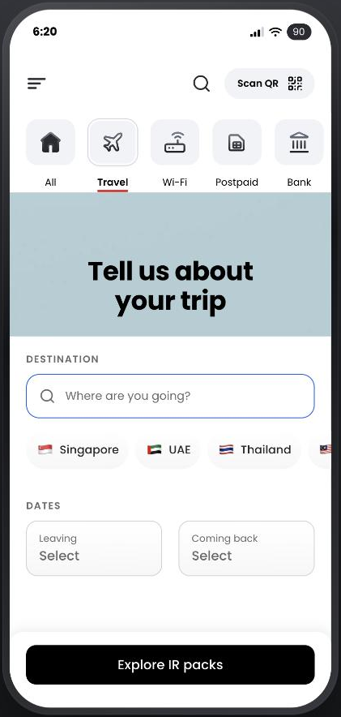
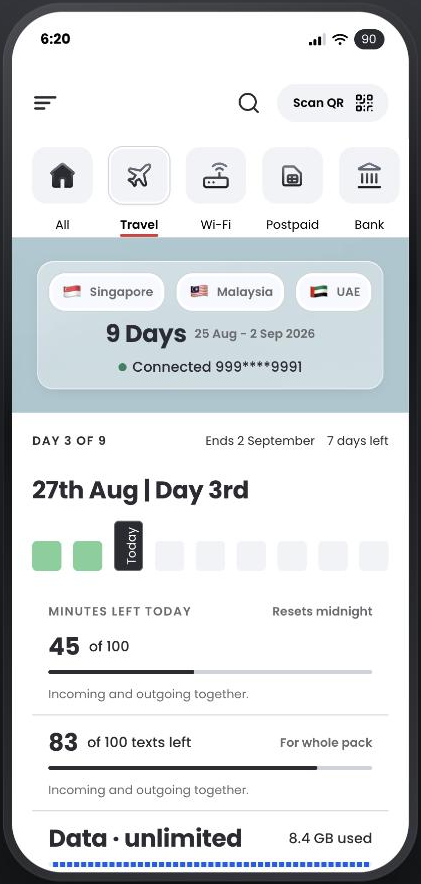
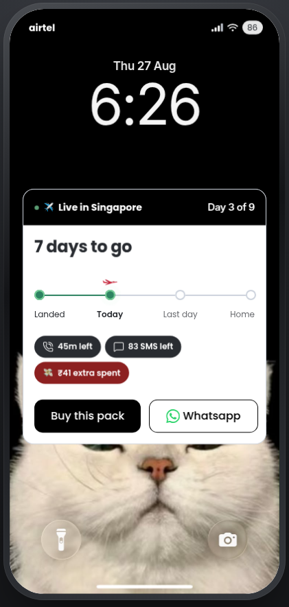

# Airtel Travel Mode

Roaming, sorted before you fly. A working frontend prototype of an international roaming flow for the Airtel app.

**Live: [airtel-travel-mode.vercel.app](https://airtel-travel-mode.vercel.app)** · **Case study: [nc-designs.vercel.app/case-study/airtel-travel-mode](https://nc-designs.vercel.app/case-study/airtel-travel-mode)**

<p align="center">
  
  
  
</p>

I designed the flow in Figma, then rebuilt all 22 screens as 13 real routes on a token system. Search filters real data, chips toggle, the calendar picks a real date range, and every price and day count downstream is derived from what you entered. No backend: data is JSON, logic is pure functions, state lives in the browser.

## What this project shows

- **Figma to code, 1:1.** `src/styles/tokens.css` mirrors the Figma Foundations board variable for variable (`bg/page` becomes `--bg-page`). `type.css` is the only file allowed to set a font size.
- **Screens as states, not pictures.** Most "screens" in the file are states of one screen (04.1, 04.2 and 04.3 are the same form empty, mid-search and filled). The index rail seeds real store state and navigates, so a reviewer can jump to any Figma frame and land in a working screen.
- **Motion with a reason.** The first tap on Travel plays a 4.6 second departure sequence with a split-flap board. Every tap after that plays a 550ms version of its ending. The set piece makes its point once; the everyday transition stays fast.
- **Honest about the gaps.** [DIVERGENCES.md](./DIVERGENCES.md) lists every deliberate departure from Figma: states the file never drew (range calendar, empty search, validation, FAQ answers) and numbers that now compute instead of being typed.
- **Reviewable on any device.** Below 600px the presenter frame drops away and the 393pt design scales to the phone, so every Figma measurement stays in proportion.

## Built with

React 19, TypeScript, Vite, Zustand, Radix, Motion, react-day-picker, Vaul, oxlint.

## How it's organised

```
src/
  styles/     tokens.css (Figma Foundations, 1:1), type.css (all text styles)
  data/       JSON: countries, packs, copy, notifications, FAQ
  lib/        Pure functions: dates, pricing, recommendation, search, validation
  state/      Zustand stores and the scenario snapshots the index rail applies
  ui/         Primitives, one folder each, with full variant sets
  patterns/   Blocks shared across screens (destination picker, trip summary)
  screens/    The 13 routes
  app/        Device frame, index rail, router
```

`#/dev/gallery` renders every token and component variant side by side, read live from `tokens.css`. The rail's **Ghost the Figma render** toggle overlays the Figma export in difference blend mode, so anything that drifted lights up.

## Run it locally

```bash
npm install
npm run dev      # http://localhost:5173
npm run build
npm run lint
```

## Notes

- `src/data/settings.json` pins "today" to a fixed date, so trip lengths and bill dates always match the Figma file.
- Overlays render inside the phone frame (`#device-portal`), never on `document.body`.
- `src/legacy/` holds the first version, a Figma scene-graph player. It's excluded from the build and kept for comparison.

A design concept, not an official Airtel product.
